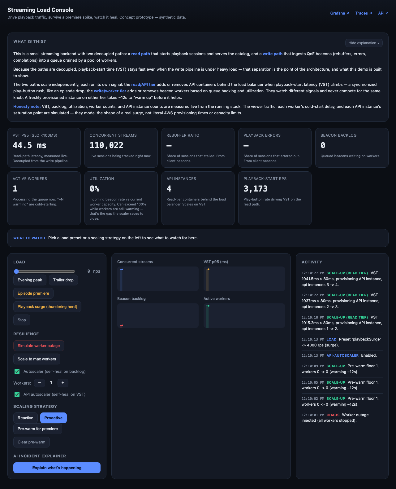

# Streaming Discovery API

A content and discovery API for a streaming catalog, built to demonstrate
scalability and resilience under real load. Independent concept prototype by
Danny Kilkenny — synthetic data, not affiliated with any company.

> The point of this repo is honesty: it produces **measured** numbers (Redis hit
> rate, RabbitMQ queue depth, p99 latency) under real load, in a real stack, not
> a simulation with invented figures. See [DESIGN.md](./DESIGN.md).

## Stack

Node.js · Fastify · TypeScript · Redis · RabbitMQ · Postgres · OpenTelemetry ·
Prometheus · Grafana · Jaeger · Caddy · Docker · k6 · OpenRouter (AI explainer)

The AI explainer is optional. To enable it: `cp .env.example .env` and set
`OPENROUTER_API_KEY` (model configurable via `OPENROUTER_MODEL`). Without a key it
falls back to a deterministic rule-based explanation, so nothing breaks.

## Run it (one command)

Requires Docker. From the repo root:

```bash
make up          # build, start the stack, wait for health, seed the catalog
```

Then open the **Load Console** at **https://console.localhost** and drive it from the browser.



### The Load Console

An interactive control room for the system:

- **Drive real load** — a traffic dial and presets (Normal / Spike / Event storm). Clicks hit a load-generator service that puts real HTTP load on the API.
- **Self-healing autoscaler** — toggle it on and hit **Event storm**: one worker can't keep up (each event does ~4ms of simulated downstream processing, so per-worker throughput is bounded the way a real enrichment pipeline is), the queue backs up, and the autoscaler scales workers up proportionally to drain it, then back down when the surge passes. Read latency stays flat the whole time — reads are decoupled from the write pipeline. **Simulate worker outage** shows the same recovery from a hard failure.
- **Live distributed tracing** — API and worker are OpenTelemetry-instrumented; one click opens the trace waterfall (HTTP → Redis → RabbitMQ → Postgres) in **Jaeger**.
- **AI incident explainer** — reads the live metrics and event log and writes a plain-English "what's happening" via OpenRouter (falls back to a deterministic reading with no API key).
- Live sparklines and a color-coded activity feed, all dependency-free.

Prefer the command line? `make load` runs a containerized k6 ramp instead.

Watch the raw telemetry at **https://grafana.localhost** (Grafana → "Streaming Discovery API").

| Service | HTTPS (Caddy + mkcert) | Plain HTTP |
|---|---|---|
| Load Console | https://console.localhost | http://localhost:8080 |
| Grafana | https://grafana.localhost | http://localhost:3001 |
| Jaeger (traces) | https://jaeger.localhost | http://localhost:16686 |
| Discovery API | https://api.localhost/discover | http://localhost:3000/discover |
| Prometheus | https://prometheus.localhost | http://localhost:9090 |
| RabbitMQ UI | — | http://localhost:15673 (streaming / streaming) |

Tear down with `make down` (keeps data) or `make clean` (wipes it).

### HTTPS with a trusted cert

The stack terminates TLS in a Caddy reverse proxy using a locally-trusted
certificate from [mkcert](https://github.com/FiloSottile/mkcert), so browsers
that force HTTPS on `localhost` get a green lock instead of a warning. `make up`
generates the cert automatically. One-time setup on a new machine:

```bash
brew install mkcert   # or your platform's package
mkcert -install       # trust the local CA (asks for your password once)
```

The `*.localhost` hostnames resolve to loopback automatically in modern browsers;
no `/etc/hosts` edits needed. Certs live in `caddy/certs/` and are gitignored.

## What to look for under load

- **Read latency** stays low (p95 SLO < 250ms) because discover/detail/search are
  cache-first in Redis.
- **Cache hit rate** climbs from cold toward ~0.8+ as the working set warms.
- **Queue depth** rises when engagement events burst, then drains as the worker
  keeps up — visible backpressure, not a hidden failure.
- **Scale the API out** and watch p99 recover:
  ```bash
  docker compose up -d --scale api=4 --no-recreate
  ```

## Observability

Metrics are always on (Prometheus + Grafana). Distributed tracing is
OpenTelemetry, opt-in via `OTEL_ENABLED=true` pointed at any OTLP collector
(Grafana Cloud, a Datadog agent, etc.) — one env var, no code change.

## Layout

```
api/            Fastify service (API + worker share one image, switched by ROLE)
  src/routes/   discover, title detail, search, events
  src/lib/      db, redis, rabbit, cache helper
  src/worker.ts queue consumer that aggregates engagement into trending scores
db/schema.sql   catalog + stats schema (applied on first boot)
load/           k6 load script
observability/  prometheus config + grafana dashboard (provisioned)
```

## Phase 2 (deploy)

The same images lift to ECS Fargate behind an ALB, with a Lambda control plane
that scales the stack up on demand and back to zero after idle, and a distributed
k6 fleet on Fargate Spot for six-figure concurrent load. Near-zero cost at rest.
Kept as a ready follow-up, not required to run everything above.
