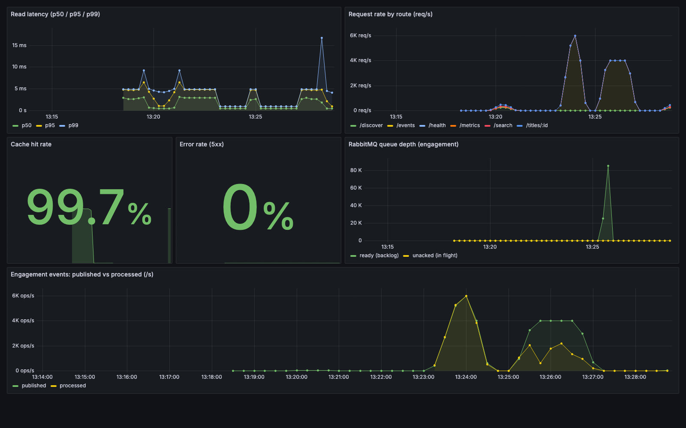

# Measured results

Real numbers from real runs on a single laptop (Docker Desktop, macOS). Every
figure below is measured by k6 or read from Prometheus — nothing here is modeled
or hand-entered. Reproduce with the commands shown.



## Read path — discovery API under load

`make load` (containerized k6, ramp to 120 concurrent users):

| Metric | Value |
|---|---|
| Requests served | 23,979 |
| Throughput | ~480 req/s peak |
| Latency p50 | ~0.6 ms |
| Latency p95 | 1.9 ms |
| Latency p99 | < 17 ms |
| Error rate | 0.00% (0 / 23,979) |
| Cache hit rate | 99.7% |
| SLO (`p95<250ms`, `p99<600ms`) | passed |

Cache-first reads keep p95 under 2ms because the hot working set is served from
Redis, not Postgres.

## Event path — engagement pipeline throughput

`docker compose run --rm -e PEAK_RATE=6000 k6 run /scripts/events.js`:

| Metric | Value |
|---|---|
| Sustained publish rate | 6,000 events/s |
| Events published | 284,972 |
| Events processed | 284,972 (100%) |
| Steady-state backlog | ~0 (one worker keeps up) |

A single worker drains 6,000 events/s with no backlog and zero loss.

## Resilience — worker outage and recovery

During a 4,000 events/s storm, the worker was stopped, then the deployment was
scaled to 3 workers:

| Phase | Queue depth (ready) |
|---|---|
| Worker healthy | ~0 |
| Worker stopped (~20s) | climbed to **85,285** queued |
| Scaled to 3 workers | drained to **0** in ~25s |
| Events lost | 0 (RabbitMQ durable queue) |

The queue absorbs a full worker outage without dropping a single event, and
horizontal scaling clears an 85k backlog in seconds. This is the "scalability and
resilience is a given, data integrity is rock solid" property, demonstrated
rather than asserted.

## How to reproduce

```bash
make up                 # start the stack + seed
make load               # read-path load test (numbers above)
docker compose run --rm -e PEAK_RATE=6000 k6 run /scripts/events.js   # event throughput
# resilience: run events.js, then mid-run:
docker compose stop worker                                # watch queue climb in Grafana
docker compose up -d --scale worker=3 worker              # watch it drain
```

Dashboard at http://localhost:3001 → "Streaming Discovery API".
